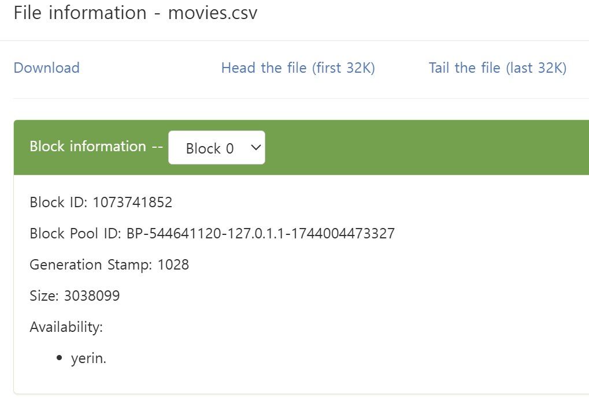
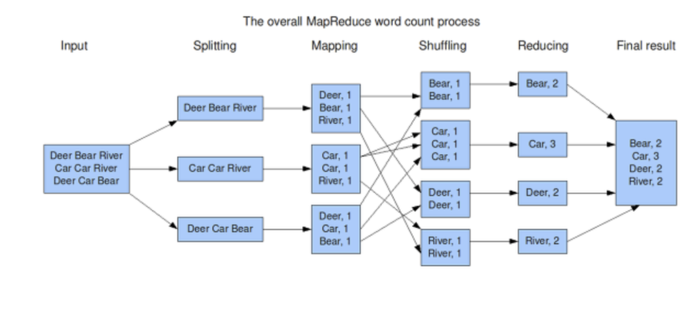
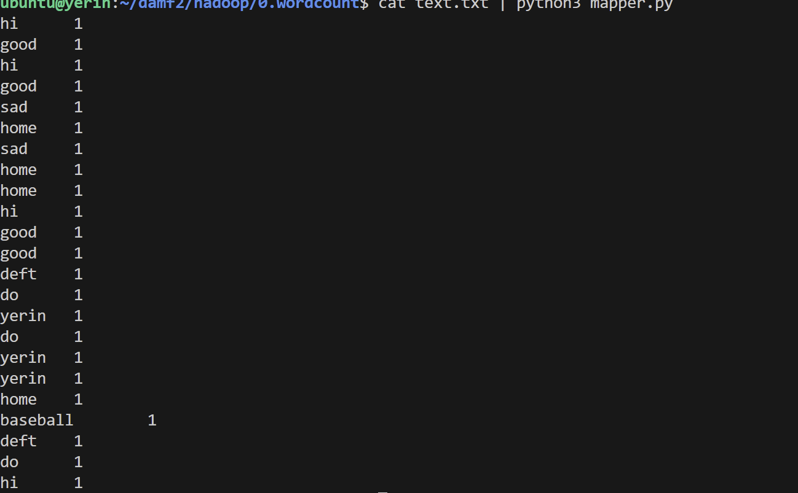
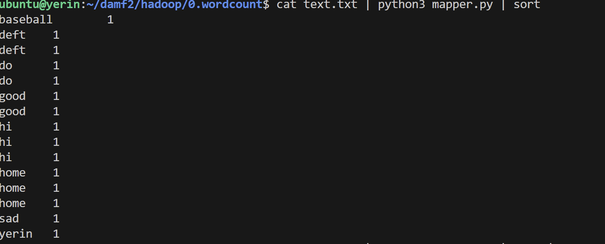
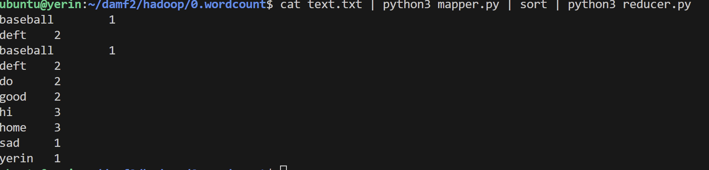
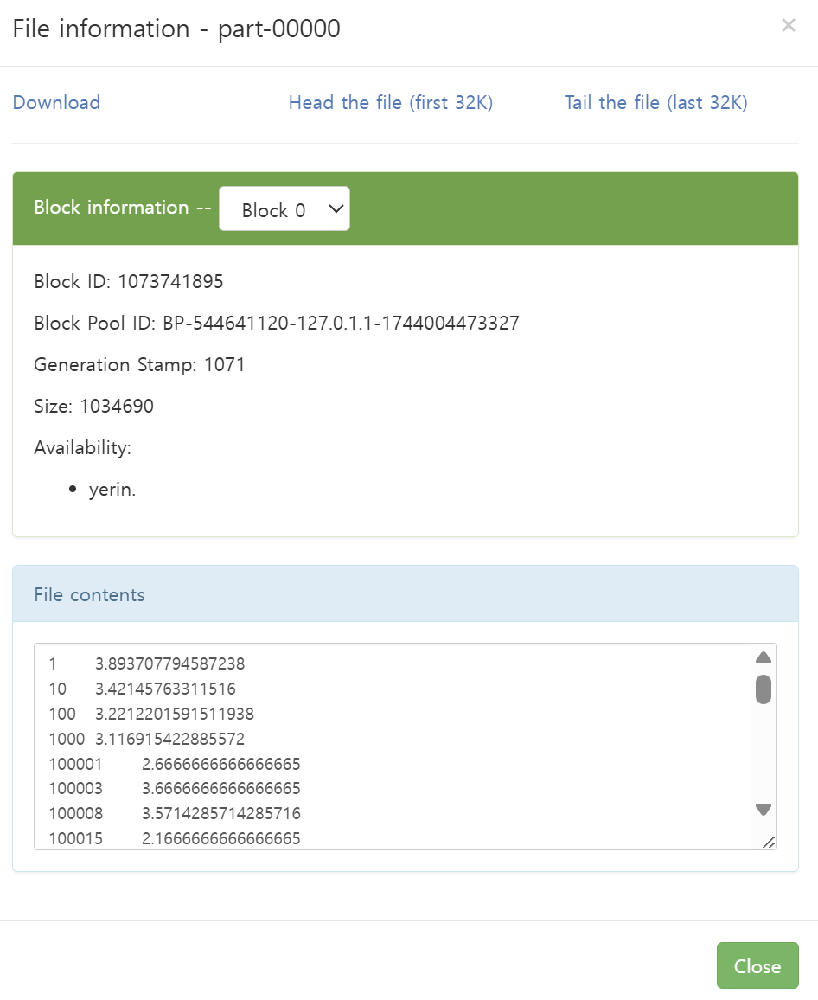
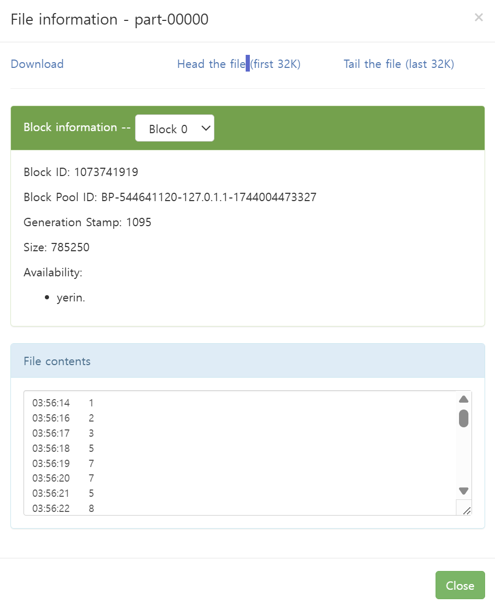

# hadoop command

- `ls`
    - `hdfs dfs -ls /`
    -  : hdfs dfs -ls <확인하고 싶은 경로> 위에 `/`는 루트 표시 

- `mkdir`
    - `hdfs dfs -mkdir /input`
    - : hdfs dfs -mkdir <생성하고 싶은 폴더 이름>

- `put`
    - `hdfs dfs -put <업로드할 파일 경로> <업로드할 위치>`
    - : hdfs dfs -put ml-25m/movies.csv /input

- `cat`
    - `hdfs dfs -cat <출력하고싶은 파일 경로 >`
    - hdfs dfs -cat /input/movies.csv 
    - 내가 출력하고 싶은 전체 코드 

- `head`, `tail`
    - `hdfs dfs -head <출력하고 싶은 파일 경로>`
    - hdfs dfs -head /input/movies.csv
    - head (앞에 내용), tail (뒤에 내용)

- `rm`
    - `hdfs dfs -rm <지울 파일 경로>`
    - hdfs dfs -rm /ratings.csv
    - 폴더를 삭제할 경우 -r 옵션 추가
    - `hdfs dfs -rm -r /input`


---

# 2025.04.08 
- windows/system32/drivers/etc/hosts(맨위에 파일)
    -  여기서 yerin. 가져오기 
    - 127.0.0.1 yerin. vscode로 실행해서 저장하기
    -  
    - 그럼 이렇게 데이터를 볼 수 있음   
- 하둡은 데이터를 수정 할 수 없음 (추가는 가능)

## 🔹MapReduce의 Map과 Reduce 개념 정리
- Map 단계

    - 데이터를 꺼내서 가공하는 역할

    - 입력 데이터를 키-값(key-value) 쌍으로 변환함

    - 데이터를 분할하고 필터링하는 단계로, 병렬로 실행됨

    - 예시:

        - 텍스트에서 단어를 꺼내고 (단어, 1) 형태로 변환

- Reduce 단계

    - Map에서 나온 키-값 쌍을 같은 키끼리 모아서 처리함

    - 합산, 평균, 집계, 정렬 등의 로직을 수행

    - 예시:

        - (단어, [1, 1, 1, 1]) → 단어의 총 개수: 4


- 
    - `mapper.py`에서 
        - ```python
            # 데이터를 쪼개는 역할
            import sys

            for line in sys.stdin: # text.txt 파일을 전부다 sys.stdin으로 불러와서 한줄씩 line에 저장하기
                line = line.strip() # 좌우 공백 없애기
                words = line.split()
                # ['hi', 'good', 'sad']
    
                for word in words:
                 print(f'{word}\t1') #\t:한줄씩 내려쓰기 
            ```
    - `cat text.txt | python3 mapper.py`로 출력해보면 
    - `reducer.py`에서
        - ```python
            import sys

            # hi      1
            # good    1
            # sad     1
            # home    1
            # ...
            # 위에 데이터들이 sys.stdin에 들어감

            last_word = None # 글자가 바뀌는 시점을 찾기 위해
            total_count = 0


            for line in sys.stdin:
                word, value = line.split() 
                value = int(value)
                
                if last_word == word:
                    total_count += value

                else:
                    if last_word is not None: # none이 아닐 때 (최초가 아닐때)
                        print(f'{last_word}\t{total_count}')
                    last_word = word
                    total_count = value # 새로운 단어가 들어왔으니깐 1부터 다시 시작
                    
            if last_word == word:
                print(f'{last_word}\t{total_count}')
            ```
- 
- 
- 여기서 터미널에 명령어 
    - `hadoop jar ~/hadoop-3.3.6/share/hadoop/tools/lib/hadoop-streaming-3.3.6.jar\
 -input /input/text.txt \
 -output /output/wordcount \
 -mapper 'python3 /home/ubuntu/damf2/hadoop/0.wordcount/mapper.py' \
 -reducer 'python3 /home/ubuntu/damf2/hadoop/0.wordcount/reducer.py'`를 실행하면 `http://localhost:9870/explorer.html#/output/wordcount`에서 이러한 결과가 나옴

---
## hadoop version
- input : 데이터 어디서 가져올건지
- output : 데이터를 어디다가 저장할지
- mapper
- reducer
- 명령어 실행행
- `hadoop jar ~/hadoop-3.3.6/share/hadoop/tools/lib/hadoop-streaming-3.3.6.jar\
 -input /input/text.txt \
 -output /output/wordcount \
 -mapper 'python3 /home/ubuntu/damf2/hadoop/0.wordcount/mapper.py' \
 -reducer 'python3 /home/ubuntu/damf2/hadoop/0.wordcount/reducer.py'`

 - chmod +x or chmod 755 rwx|rwx|rwx

---
# 1. 영화의 평점 평균 
- hdfs dfs -put ml-25m/input

- `/hadoop/1.movie-rate/avg/mapper.py`
    - ```python 
        import sys

        for line in sys.stdin:
            line = line.strip()
            
            fields = line.split(',') # ,를 기준으로 쪼개기
            # ['1', '296', '5.0', '11133451414']
            
            movie_id = fields[1]
            rating = fields[2]
            
            
            print(f'{movie_id}\t{rating}')
        ```
- `/hadoop/1.movie-rate/avg/reducer.py`
    - ```python
        import sys #sys.stdin을 사용하기 위해 sys 모듈을 불러옴


        currunt_movie_id = None # 현재 처리중인 영화 ID NONE으로 초기화
        currunt_sum = 0 # 총 평점
        currunt_count = 0 # 평점 개수

        for line in sys.stdin:   
            line = line.strip() # 공백제거
            # 줄 끝의 공백 문자(개행 포함) 를 제거

            # 예: "123 5.0\n" → "123 5.0"
            movie_id, rating = line.split() # 공백을 기준으로 문자열을 분리해서 movie_id, rating 변수에 각각 저장장
            
            try:
                rating = float(rating)
                # 평점 값을 숫자로 변환 시도 
            except: # 평점이 숫자가 아닌 경우는 건너뜀(에러가 나면)
                continue # for문을 무시하고 다음 for문으로 넘어가기 
            
            # 123, 5.0 
            # 123, 3.5
            # 123, 4.0
            # 234, 4.2  영화의 코드 숫자가 바뀔때까지 출력하기 
            
            if currunt_movie_id == movie_id:
                # 같은 영화라면 
                currunt_count += 1 # 평점 개수 증가
                currunt_sum += rating # 평점 합계도 추가가
                
            else: # 영화가 바뀌었을 떄
                if currunt_movie_id is not None:
                    # 처음이 아니라면 ( 이미 하나 이상 영화가 처리된 상태라면면)
                    currunt_avg = currunt_sum / currunt_count # 이전 영화의 평균 평점을 계산해서 출력함함
                    print(f'{currunt_movie_id}\t{currunt_avg}')
                
                # 현재 영화 id 기준으로 다시 초기화
                # 이제부터 이 영화의 평점을 새로 모으기 시작함
                currunt_movie_id = movie_id
                currunt_count = 1
                currunt_sum = rating
            
        currunt_avg = currunt_sum / currunt_count
        print(f'{currunt_movie_id}\t{currunt_avg}') #  루프가 끝난 후, 마지막 영화의 평균을 마지막으로 출력함
        #(루프 안에서는 영화 ID가 바뀔 때만 출력하기 때문에, 마지막 영화는 따로 처리 필요!)
        ```
- 터미널에 명령어 실행
    - `hadoop jar ~/hadoop-3.3.6/share/hadoop/tools/lib/hadoop-streaming-3.3.6.jar\
 -input /input/ratings.csv \
 -output /output/movie-rate-avg \
 -mapper 'python3 /home/ubuntu/damf2/hadoop/1.movie-rate-avg/mapper.py' \
 -reducer 'python3 /home/ubuntu/damf2/hadoop/1.movie-rate-avg/reducer.py'`
- http://localhost:9870/explorer.html#/output 에서  이러한 결과가 나옴 

# 2. log-time 
- 로그인 접속한 사람 시간
- hdfs dfs -put access.log/input
- `hadoop/2.log-time/mapper.py`
    - ```python
        import sys
        import re # 정규표현식

        # 54.36.149.41 - - [22/Jan/2019:03:56:14 +0330] "GET /filter/27|13%20%D9%85%DA%AF%D8%A7%D9%BE%DB%8C%DA%A9%D8%B3%D9%84,27|%DA%A9%D9%85%D8%AA%D8%B1%20%D8%A7%D8%B2%205%20%D9%85%DA%AF%D8%A7%D9%BE%DB%8C%DA%A9%D8%B3%D9%84,p53 HTTP/1.1" 200 30577 "-" "Mozilla/5.0 (compatible; AhrefsBot/6.1; +http://ahrefs.com/robot/)" "-"
        # 위에는 실제 로그 한 줄의 예시
        # :03:56:14
        time_pattern = re.compile(r':(\d{2}):(\d{2}):(\d{2})')
        # (r 뒤에 있는 문자는 정규표현식이라는 의미) :\d{2}어떤 숫자든 2자리 숫자이면 가능하다는 의미
        # :(\d{2}):(\d{2}):(\d{2}) → 예: :03:56:14

            #첫 번째 \d{2}: 시(hour)

            #두 번째 \d{2}: 분(minute)

            #세 번째 \d{2}: 초(second)
        # 이 정규표현식은 :03:56:14에서 숫자만 뽑기 위해 만든 것
        for line in sys.stdin:
            line = line.strip()
            # 줄 끝에 있는 줄바꿈 문자(\n)나 공백을 제거

            match = time_pattern.search(line)
            # 아까 만든 정규표현식 time_pattern을 이용해서
            # 현재 줄(line)에서 시간 정보를 찾는 부분
            if match: # match가 None이 아니면 
                hour = match.group(1)
                print(f'{hour}\t1')
                # (r':(\d{2}:\d{2}:\d{2})') 여기서 소괄호로 묶은것중 첫번쨰 0번째가 아닌 1번째인 이유는 0번째는 소괄호 그자체를 의미
    - `hadoop/2.log-time/reducer.py`
        - ```python     
            import sys

            last_hour = None # 이전 줄의 시간 정보 저장용용
            total_count = 0 # 현재 시간대에 대한 총 요청 수 저장용

            # 03    1
            # 03    1
            # 04    1
            # 05    1 # mapper가 출력한 예시


            for line in sys.stdin: # hadoop이 mapper -> reducer로 넘긴 데이터를 한 줄씩 읽는 반복문
                line = line.strip()

                hour, value = line.split() # 탭이나 공백을 기준으로 시간과(hour)과 개수(value)분리
                value = int(value) 

                if last_hour == hour: # 같은 시간대니깐 value를 누적
                    total_count += value
                else: # 다른 시간대로 바뀌면 -> 지금까지 누적한 결과를 출력하고 
                    if last_hour is not None:
                        print(f'{last_hour}\t{total_count}')
                    
                    last_hour = hour # 현재 시간대를 바꾸고 새로운 시간대에 대한 카운트 시작
                    total_count = value

            print(f'{last_hour}\t{total_count}') # 마지막 줄은 for문이 끝나고 나서 따로 또 한번 더 출력해주기 
            ```
- `hadoop jar ~/hadoop-3.3.6/share/hadoop/tools/lib/hadoop-streaming-3.3.6.jar\
 -input /input/access.log \
 -output /output/log-time \
 -mapper 'python3 /home/ubuntu/damf2/hadoop/2.log-time/mapper.py' \
 -reducer 'python3 /home/ubuntu/damf2/hadoop/2.log-time/reducer.py'` 터미널에서 실행해주기

- http://localhost:9870/explorer.html#/output/log-time  
    


